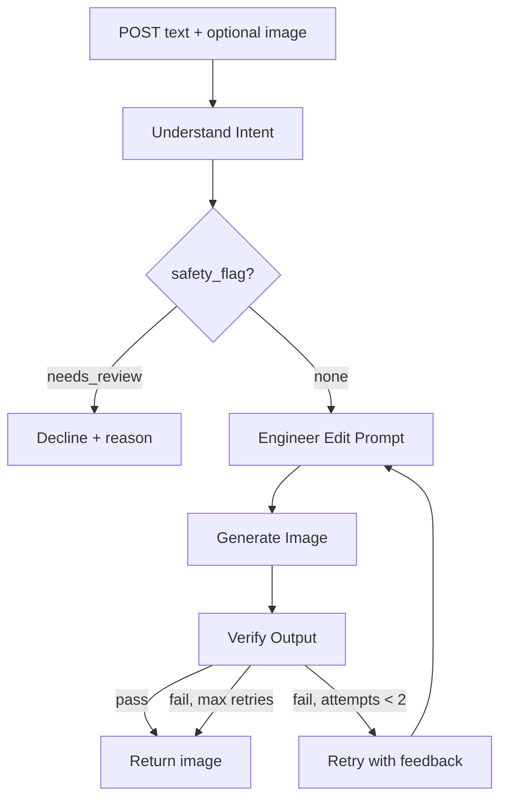
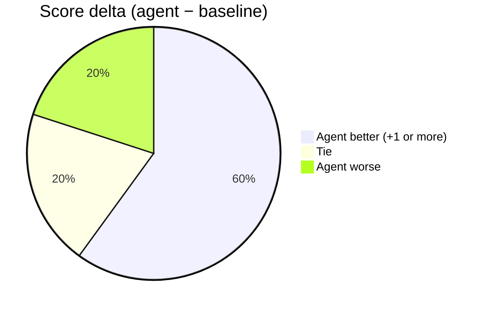

# Meme Agent — Eval Report

**Run:** `eval/eval.py --local` (direct Gemini, bypasses n8n)  
**Models:** `gemini-3.6-flash` (text), `gemini-2.5-flash-image` (image)  
**Judge:** LLM-as-judge (same text model, 1–5 scale)  
**Date:** 2026-08-31

---

## Summary

| Metric | Baseline | Agent |
|--------|----------|-------|
| Avg score | **2.80 / 5** | **3.90 / 5** |
| Δ vs baseline | — | **+1.10 (+39%)** |
| Cases needing retry | 0 | **1 / 10 (10%)** |

**Artifacts:** 19 PNGs in `eval/results/`, scores in `eval/results/eval_results.json`

**Caveat:** `animal_meme_01` agent path still shows pre-policy-decline score (0); baseline ran under updated policy. Re-run agent only if needed.

---

## Agent Workflow

**Baseline workflow:** text (+ image) → single image-gen call → return. No intent, verify, or retry.

---

## Score by Case

```mermaid
xychart-beta
    title "Baseline vs Agent (1–5)"
    x-axis ["drake", "distracted", "this_is_fine", "face_01", "face_02", "caption", "vague", "ambiguous", "hard", "animal"]
    y-axis "Score" 0 --> 5
    bar [2, 2, 4, 3, 2, 0, 5, 3, 3, 4]
    bar [5, 5, 4, 5, 5, 4, 5, 4, 2, 0]
```

| Case | Baseline | Agent | Δ | Retries |
|------|----------|-------|---|---------|
| drake_01 | 2 | 5 | +3 | 0 |
| distracted_bf_01 | 2 | 5 | +3 | 0 |
| this_is_fine_01 | 4 | 4 | 0 | 0 |
| face_swap_reaction_01 | 3 | 5 | +2 | 0 |
| face_swap_reaction_02 | 2 | 5 | +3 | 0 |
| caption_only_01 | 0 | 4 | +4 | **2** |
| vague_request_01 | 5 | 5 | 0 | 0 |
| ambiguous_format_01 | 3 | 4 | +1 | 0 |
| hard_case_conflicting_instructions | 3 | 2 | −1 | 0 |
| animal_meme_01 | 4 | 0 | −4 | — |

---

## Agent Wins / Losses

| Outcome | Cases |
|---------|-------|
| Agent +1 or more | drake, distracted, face_01, face_02, caption, ambiguous |
| Tie | this_is_fine, vague |
| Agent worse | hard_case (−1), animal (−4, agent declined) |

---

## Where Agent Adds Value

| Step | What it fixes | Example |
|------|---------------|---------|
| Intent parsing | Vague/colloquial → structured format | `ambiguous_format_01`: "that meme with two buttons" → Two Buttons template |
| Prompt engineering | Caption-only → full meme image | `caption_only_01`: baseline returned text only (0/5); agent 4/5 after 2 retries |
| Verify + retry | Face placement, layout | `face_swap_reaction_01`: baseline 3/5 (wrong panels); agent 5/5 |
| Safety routing | Decline before gen (intended) | `animal_meme_01`: agent score 0 — decline path not re-validated this run |

---

## Pipeline Phases (n8n agent)

| Phase | Nodes | Purpose |
|-------|-------|---------|
| 1 | Webhook → Understand Intent → Parse JSON | Structure request, detect format |
| 2 | Safety Flag? → Decline OR continue | Policy gate |
| 3 | Engineer Prompt → Generate Image | Build + execute image prompt |
| 4 | Verify → Retry loop (max 2) | Self-correction |

Full node traces: `eval/results/trajectories.json`

---

## Run Process Notes

- Eval ran via `--local` (Gemini API direct); n8n webhooks optional for demo replay.
- Resume mode skips existing PNGs — no duplicate generation.
- ~4 min/image; 10 cases × 2 pipelines ≈ 80 min wall time (with stalls/retries).
- Known failures: baseline text-only on caption requests; judge/API 503 stalls on long runs.

---

## Files

| Path | Contents |
|------|----------|
| `eval/results/eval_results.json` | Scores + reasoning |
| `eval/results/*.png` | Generated images |
| `eval/results/trajectories.json` | Per-phase workflow traces |
| `workflows/agent.json` | Full agent (18 nodes) |
| `workflows/baseline.json` | One-shot baseline (4 nodes) |
